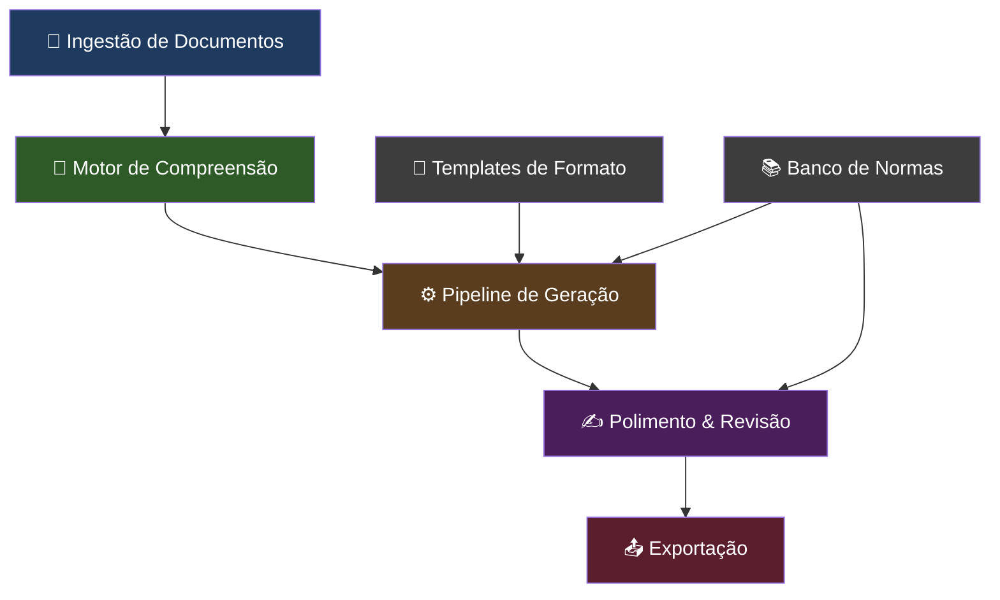

# Novo Escriba — Central de Processamento e Geração de Texto

## Visão Geral

O **Nuevo Escriba** é uma central modular de processamento, geração e polimento de textos acadêmicos e formais em português brasileiro. Seus diferenciais:

1. **Fidelidade radical ao conteúdo-fonte** — o sistema nunca "inventa"; tudo que gera é rastreável ao material ingerido
2. **Português brasileiro formal impecável** — linguagem de nível acadêmico/institucional
3. **Conformidade com normas e regimentos** — ABNT, diretrizes de cada tipo textual
4. **Modularidade de formato** — o mesmo conteúdo pode ser moldado em artigo científico, apostila, TCC, relatório técnico, etc.

---

## Arquitetura Proposta



### Módulo 1: Ingestão de Documentos (`ingestor.py`)
Responsável por ler e normalizar os documentos-fonte.

- Suporta PDF, DOCX, TXT (e futuramente imagens via OCR)
- Leitura de **múltiplos arquivos** simultaneamente (aproveitando os 128k tokens do Sabiázinho-4)
- Gera um **hash de conteúdo** para cache e rastreabilidade
- Extrai metadados (título provável, autor, data, referências citadas)

#### [NEW] [modules/ingestor.py](file:///home/pit/Programas/Scripts/Escriba/modules/ingestor.py)

---

### Módulo 2: Motor de Compreensão (`comprehension.py`)
Processa o conteúdo ingerido e cria uma representação estruturada.

- Gera um **mapa semântico** do conteúdo (tópicos, subtópicos, argumentos, dados)
- Identifica trechos citáveis e referências
- Classifica o tipo de conteúdo (teórico, empírico, normativo, narrativo)
- **Anti-alucinação**: toda informação é indexada com a localização no documento-fonte

#### [NEW] [modules/comprehension.py](file:///home/pit/Programas/Scripts/Escriba/modules/comprehension.py)

---

### Módulo 3: Pipeline de Geração (`generator.py`)
O coração do sistema. Gera texto a partir do conteúdo compreendido + template de formato.

- Recebe o mapa semântico + template selecionado
- Gera cada seção do documento respeitando a estrutura exigida pelo formato
- **Instrução de fidelidade** embutida no system prompt: "Use APENAS informações presentes no material-fonte. Se a informação não está no material, NÃO a inclua."
- Controle de tom: formal acadêmico brasileiro

#### [NEW] [modules/generator.py](file:///home/pit/Programas/Scripts/Escriba/modules/generator.py)

---

### Módulo 4: Templates de Formato (`templates/`)
Cada template define a estrutura, as regras e as normas que o gerador deve seguir.

> [!IMPORTANT]
> Cada template contém: a estrutura obrigatória do documento, as normas aplicáveis (ABNT, regimentos), e instruções específicas para o sistema de prompt.

| Template | Norma Principal | Estrutura |
| :--- | :--- | :--- |
| **Artigo Científico** | ABNT NBR 6022 | Título, Resumo, Abstract, Introdução, Desenvolvimento, Conclusão, Referências |
| **TCC / Monografia** | ABNT NBR 14724 | Capa, Folha de Rosto, Resumo, Sumário, Introdução, Capítulos, Conclusão, Referências |
| **Apostila / Material Didático** | Livre (diretrizes MEC) | Unidades, Objetivos, Conteúdo, Glossário, Referências |
| **Relatório Técnico** | ABNT NBR 10719 | Capa, Resumo, Introdução, Metodologia, Resultados, Conclusão |
| **Resumo / Fichamento** | ABNT NBR 6028 | Resumo indicativo ou informativo |
| **Resenha Crítica** | Convenção acadêmica | Referência da obra, Síntese, Crítica, Conclusão |

#### [NEW] Diretório `templates/` com um arquivo JSON/YAML por formato
- `templates/artigo_cientifico.json`
- `templates/tcc_monografia.json`
- `templates/apostila.json`
- `templates/relatorio_tecnico.json`
- `templates/resumo_fichamento.json`
- `templates/resenha_critica.json`

---

### Módulo 5: Polimento & Revisão (`polisher.py`)
Revisão final do texto gerado.

- Correção ortográfica e gramatical (nível formal)
- Verificação de coerência e coesão textual
- Verificação de conformidade com o template (ex: "o artigo tem Abstract?")
- **Verificação de fidelidade**: confronta o texto gerado com o material-fonte e sinaliza trechos sem base

#### [NEW] [modules/polisher.py](file:///home/pit/Programas/Scripts/Escriba/modules/polisher.py)

---

### Módulo 6: Exportação (`exporter.py`)
Gera o documento final para download.

- PDF formatado com ReportLab (mantendo o que já existe, mas aprimorado)
- DOCX com estilos corretos (margens ABNT, fontes, espaçamento)
- TXT simples

#### [NEW] [modules/exporter.py](file:///home/pit/Programas/Scripts/Escriba/modules/exporter.py)

---

### Orquestrador e Interface (`app.py` + `escriba.py`)
A interface Streamlit redesenhada com fluxo claro:

```
1. Upload de documentos (1 ou mais)
   ↓
2. Seleção do formato de saída (Artigo, TCC, Apostila...)
   ↓
3. Configurações (idioma, modelo, nível de detalhe)
   ↓
4. Geração com barra de progresso por seção
   ↓
5. Preview do resultado + Revisão automática
   ↓
6. Download (PDF / DOCX / TXT)
```

#### [MODIFY] [app.py](file:///home/pit/Programas/Scripts/Escriba/app.py)
#### [NEW] [modules/__init__.py](file:///home/pit/Programas/Scripts/Escriba/modules/__init__.py)

---

### Configuração e Infraestrutura

#### [NEW] [.env](file:///home/pit/Programas/Scripts/Escriba/.env)
```env
MARITACA_API_KEY=113077194613426629927_32acb0450fb0d052
MARITACA_MODEL=sabiazinho-4
MARITACA_BASE_URL=https://chat.maritaca.ai/api
```

#### [NEW] [config.py](file:///home/pit/Programas/Scripts/Escriba/config.py)
- Carregamento centralizado de variáveis de ambiente via `python-dotenv`
- Constantes do projeto (modelos disponíveis, limites de tokens, etc.)

#### [MODIFY] [requirements.txt](file:///home/pit/Programas/Scripts/Escriba/requirements.txt)
```
streamlit
openai
PyPDF2
python-docx
reportlab
python-dotenv
pyyaml
```

#### [MODIFY] [.gitignore](file:///home/pit/Programas/Scripts/Escriba/.gitignore)
- Adicionar `.env` para não commitar a chave

---

## Estratégia Anti-Alucinação

> [!CAUTION]
> Este é o diferencial mais crítico do projeto. A fidelidade ao conteúdo-fonte é inegociável.

A estratégia opera em **3 camadas**:

1. **Camada de Prompt (Geração)**: O system prompt instrui explicitamente o modelo a usar APENAS informações do material-fonte. Qualquer afirmação deve ser rastreável ao texto original.

2. **Camada de Verificação (Pós-geração)**: O módulo Polisher faz uma segunda passada no texto gerado, confrontando-o com o material-fonte e marcando trechos que não possuem base no conteúdo original.

3. **Camada de Transparência (UI)**: Na interface, trechos gerados que não possuem correspondência direta no material-fonte são destacados com um aviso visual para o usuário decidir se mantém ou remove.

---

## Estrutura Final do Projeto

```
Escriba/
├── .env                      # Chaves e configuração (NÃO commitar)
├── .env.example              # Template para novos usuários
├── .gitignore
├── config.py                 # Carregamento de config centralizado
├── app.py                    # Interface Streamlit (orquestrador)
├── requirements.txt
├── README.md
├── modules/
│   ├── __init__.py
│   ├── ingestor.py           # Leitura e normalização de documentos
│   ├── comprehension.py      # Compreensão e mapeamento semântico
│   ├── generator.py          # Geração de texto por template
│   ├── polisher.py           # Revisão, correção e verificação de fidelidade
│   └── exporter.py           # Exportação PDF/DOCX/TXT
└── templates/
    ├── artigo_cientifico.json
    ├── tcc_monografia.json
    ├── apostila.json
    ├── relatorio_tecnico.json
    ├── resumo_fichamento.json
    └── resenha_critica.json
```

---

## User Review Required

> [!IMPORTANT]
> **Decisões que precisam da sua aprovação:**
> 1. **Modelo padrão**: Sugiro o `sabiazinho-4` (128k contexto, custo baixo). Concorda, ou quer o `sabia-4` como opção na UI?
> 2. **Ordem de implementação**: Proponho começar pelo núcleo (ingestor → gerador → exportador) e depois adicionar polimento e templates avançados. Ok?
> 3. **Templates iniciais**: Quais formatos são prioridade para a primeira versão? (Sugiro Artigo Científico + Apostila)
> 4. **Corretor antigo**: O módulo Corretor atual será absorvido pelo Polisher, ou você quer mantê-lo como ferramenta separada?

## Plano de Verificação

### Testes Funcionais
- Upload de um PDF acadêmico real e geração em formato "Artigo Científico"
- Verificar se o texto gerado contém apenas informações presentes no documento-fonte
- Testar exportação em PDF e DOCX com formatação ABNT
- Testar com múltiplos documentos simultaneamente

### Validação de Conformidade
- Comparar estrutura do artigo gerado com a NBR 6022
- Verificar se o glossário e as referências são extraídos corretamente do material-fonte
